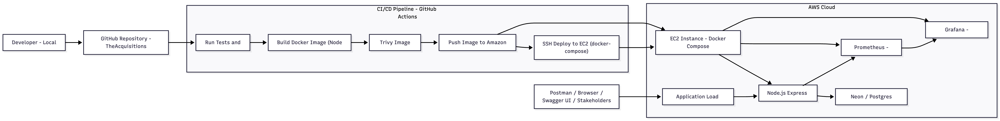
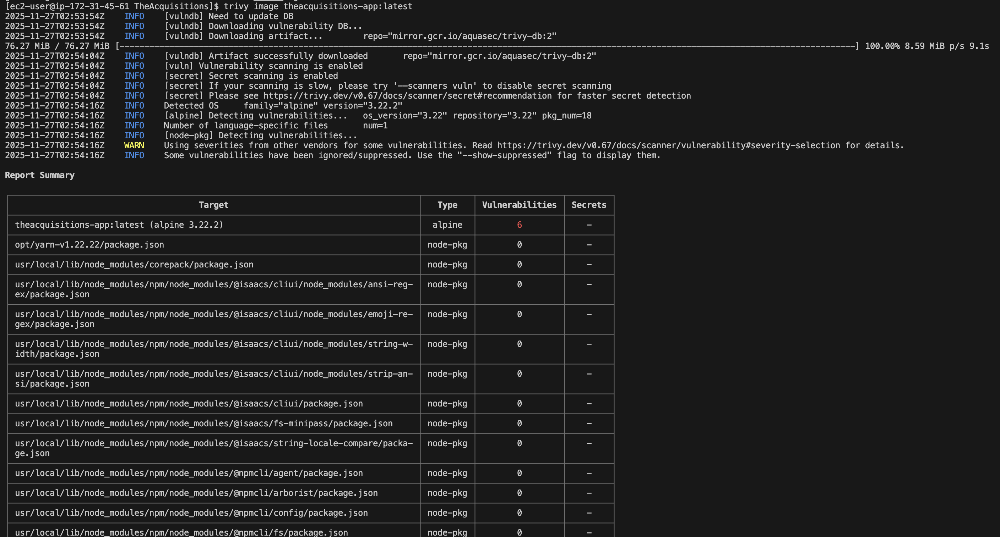
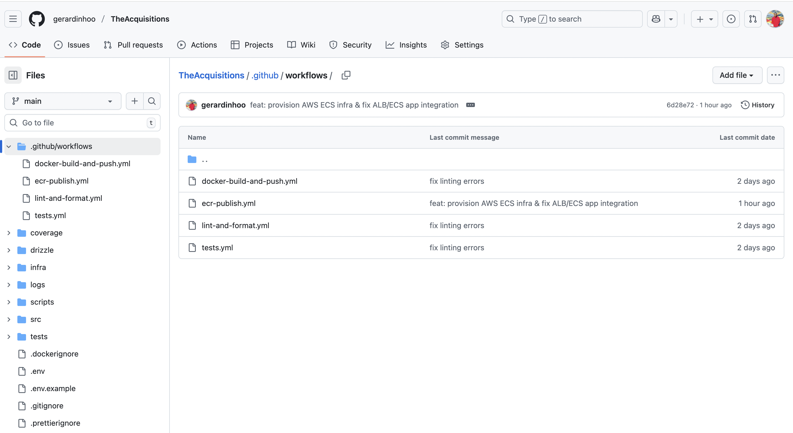
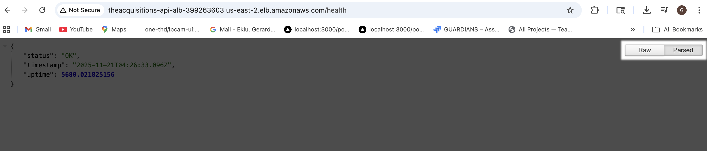
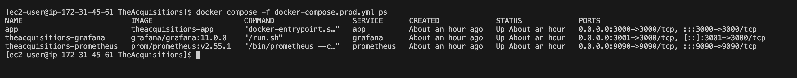
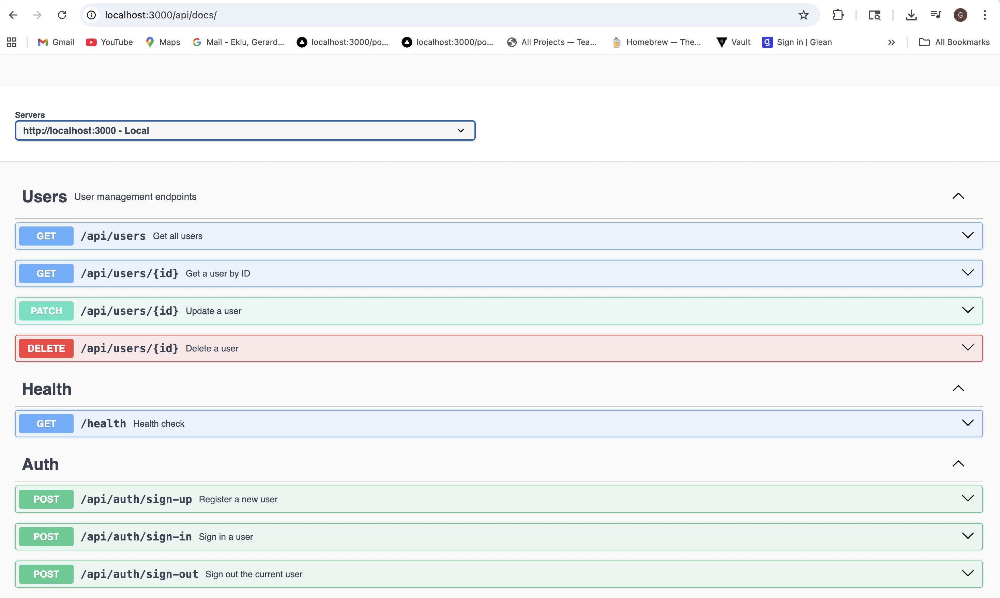

# TheAcquisitions – Cloud & DevOps Project

## 🚀 Overview

**TheAcquisitions** is a fully production-grade **Cloud + DevOps Engineering project** showcasing the complete lifecycle of a modern backend application:

- Local Node.js API development
- Full containerization using Docker
- DevSecOps with **Trivy image scanning**
- CI/CD with **GitHub Actions** (build → test → scan → push → deploy)
- Production deployment to **Amazon Linux EC2**
- Traffic served through an **AWS ALB**
- Observability with **Prometheus + Grafana**
- API documentation via **Swagger / OpenAPI**
- PostgreSQL hosted on **Neon.tech**
- Full **architecture diagram** included

This is a **portfolio-ready, job-winning project** demonstrating practical skills in cloud architecture, automation, monitoring, and backend engineering.

---

# 🏗️ Architecture Diagram



---

# 🗂️ Folder Structure

```
TheAcquisitions/
├── docker-compose.dev.yml
├── docker-compose.prod.yml
├── Dockerfile
├── drizzle.config.js
├── jest.config.mjs
├── .env.example
├── src/
│   ├── app.js
│   ├── index.js
│   ├── server.js
│   ├── config/
│   ├── controllers/
│   ├── middleware/
│   ├── models/
│   ├── routes/
│   ├── services/
│   ├── utils/
│   └── validations/
├── infra/
│   ├── monitoring/
│   │   ├── prometheus.yml
│   │   └── grafana/
│   └── terraform/
│       ├── main.tf
│       └── variables.tf
└── README.md
```

---

# ⚙️ Tech Stack

### **Backend**

- Node.js (Express)
- PostgreSQL (Neon)
- JWT Auth
- Helmet, CORS, Arcjet (bot protection)

### **DevOps & Cloud**

- Docker & Docker Compose
- GitHub Actions CI/CD
- Trivy Image Scanning
- Amazon EC2 (Amazon Linux 2023)
- Application Load Balancer
- Amazon ECR
- Prometheus
- Grafana

### **Monitoring Metrics**

- `up`
- `theacquisitions_nodejs_active_requests_total`
- `theacquisitions_nodejs_eventloop_lag_mean_seconds`

---

# 🔧 Local Development

### 1. Clone the repository

```bash
git clone https://github.com/<your-user>/TheAcquisitions.git
cd TheAcquisitions
```

### 2. Install dependencies

```bash
npm install
```

### 3. Start local development environment

```bash
docker compose -f docker-compose.dev.yml up --build
```

### 4. Access services

| Service      | URL                            |
| ------------ | ------------------------------ |
| API          | http://localhost:3000          |
| Swagger Docs | http://localhost:3000/api/docs |
| Prometheus   | http://localhost:9090          |
| Grafana      | http://localhost:3001          |

---

# 🐳 Docker Images

### Build image

```bash
docker build -t theacquisitions-app .
```

### Run container

```bash
docker run -p 3000:3000 theacquisitions-app
```

---

# 🔒 DevSecOps: Trivy Vulnerability Scanning

### Run scan

```bash
trivy image theacquisitions-app
```

---

# ⚡ GitHub Actions CI/CD Pipeline

### Pipeline includes:

1. Code checkout
2. Install dependencies
3. Lint + tests
4. Docker build
5. Trivy vulnerability scan
6. Push to ECR
7. SSH deploy to EC2

---

# ☁️ AWS Deployment (Production)

### Infrastructure

- Amazon Linux EC2
- Docker + Docker Compose
- ALB → Target Group → Container
- ECR for image storage

### Deployment Steps (via CI/CD)

#### SSH into EC2

```bash
ssh -i <pem-file> ec2-user@<public-ip>
```

#### Pull updated images

```bash
aws ecr get-login-password --region us-east-2 | docker login --username AWS --password-stdin <acct>.dkr.ecr.us-east-2.amazonaws.com
docker compose -f docker-compose.prod.yml pull
```

#### Restart services

```bash
docker compose -f docker-compose.prod.yml up -d
```

---

# 📊 Monitoring (Prometheus + Grafana)

### Prometheus scrape job

```yaml
- job_name: 'theacquisitions-app'
  static_configs:
    - targets: ['app:3000']
```

---

# 📘 Swagger API Documentation

Accessible at:

```
http://localhost:3000/api/docs
https://<ALB_DNS>/api/docs
```

---

# Screenshots

# 🔒 Trivy Vulnerability Scan



---

# ⚡ GitHub Actions CI/CD




---

# ☁️ AWS Deployment

### ALB Working Screenshot



### EC2 Docker Compose



### ECR Image Tags


### ECS Metadata


---

# 📊 Monitoring

### Prometheus


### Grafana


---

# 📘 Swagger Docs



---

# 🚧 Challenges Faced In This Project & How They Have Been Solved

### 1. Docker container unreachable

**Cause:** Node bound to `localhost`.  
**Fix:** `app.listen(PORT, "0.0.0.0")`.

### 2. Port conflicts (3000/9090)

**Cause:** Old Prometheus/Grafana services running.  
**Fix:** Disabled system services.

### 3. ALB requests blocked by Arcjet

**Cause:** Bot detection flagged ALB.  
**Fix:** Allow User-Agent or bypass internal routes.

### 4. ALB health checks failing

**Fix:** Move `/health` above middleware + fix Target Group port.

### 5. Prometheus not scraping

**Fix:** Corrected service target: `["app:3000"]`.

### 6. Grafana dashboard disappearing

**Fix:** Saved + exported dashboards correctly.

### 7. GitHub Actions failing (650MB Terraform folder)

**Fix:** Cleanup with `git filter-repo` + updated `.gitignore`.

### 8. Terraform apply failures

**Cause:** Wrong provider + missing IAM permissions.  
**Fix:** Correct provider + added IAM policies.

### 9. ECS task crash

**Cause:** Missing `DATABASE_URL`.  
**Fix:** Added ECS secrets + CloudWatch log group.

### 10. Missing `.env.production` on EC2

**Fix:** Uploaded file or used mapped secrets.

### 11. Swagger not rendering

**Fix:** Corrected swagger-jsdoc path.

### 12. Security middleware blocking routes

**Fix:** Reordered middleware.

### 13. Neon DB connectivity issues

**Fix:** Corrected ECS secret mapping.

---

# 🏁 Conclusion

This project demonstrates:

- Cloud deployment on AWS
- CI/CD automation
- Container orchestration
- Monitoring + observability
- Secure API development
- Real-world troubleshooting

A strong portfolio project for roles like:

- DevOps Engineer
- Cloud Engineer
- SRE
- Platform Engineer

---

# ⭐ Author

**Gerard Eklu** — DevOps & Cloud Engineer

---

# 📄 License

MIT
